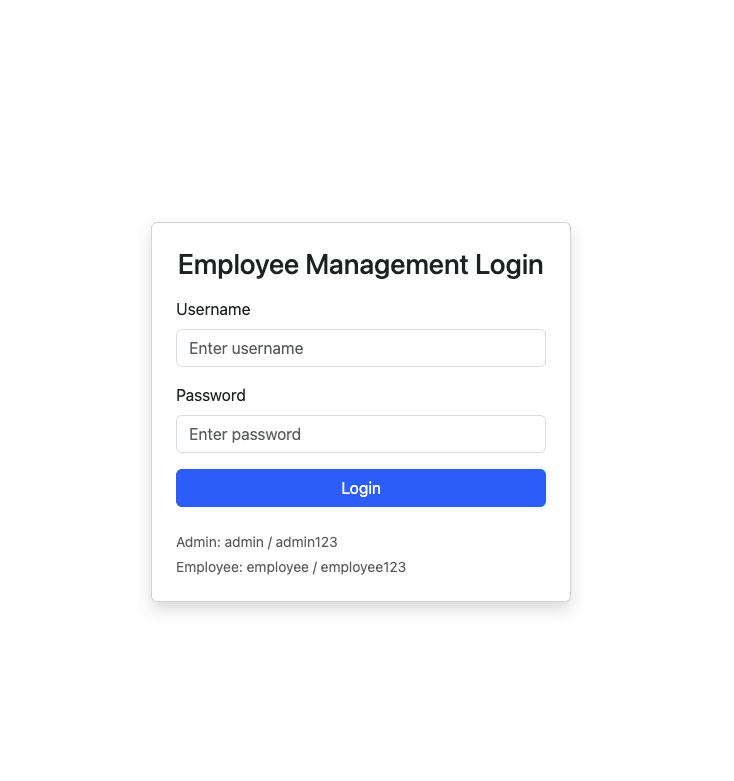
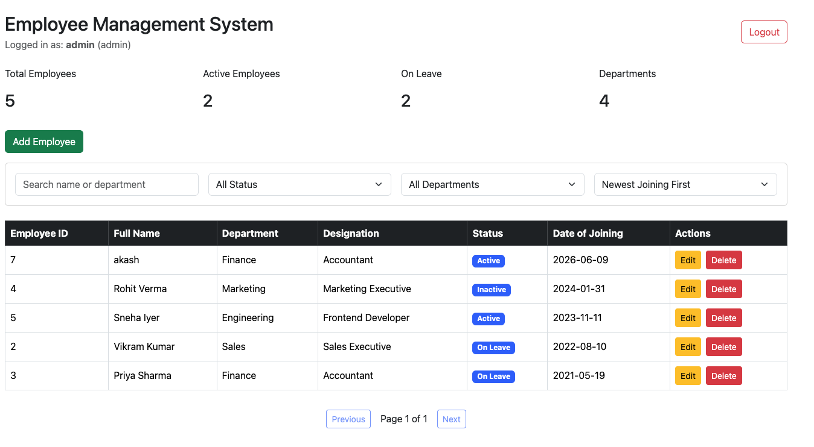
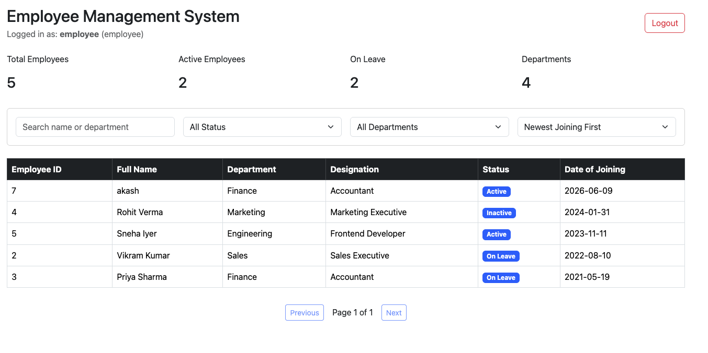
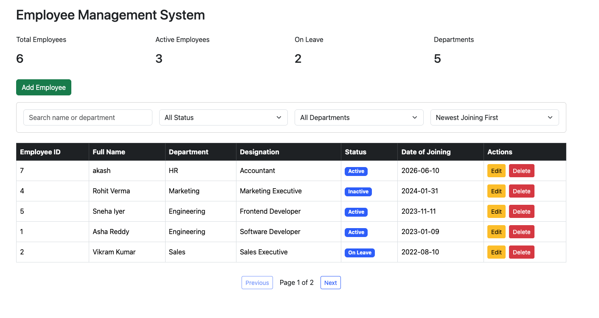
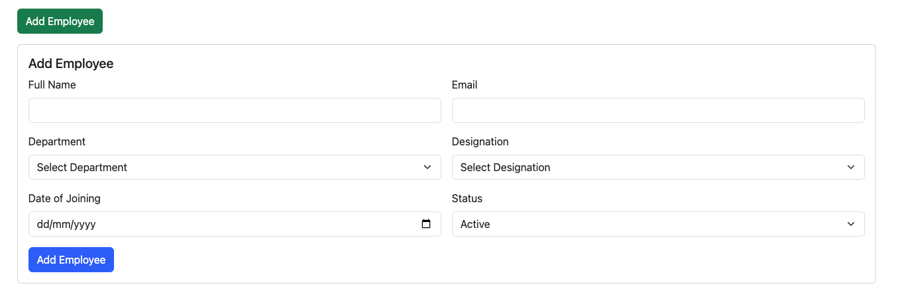

# Employee Management System

A full-stack Employee Management System built using **React.js, Node.js, Express.js, MySQL, JWT Authentication, and Role-Based Access Control (RBAC)**.

This project allows users to securely login and manage employee records. Admin users can add, update, delete, and view employees, while employee users can only view employee data.

---

## Project Overview

The Employee Management System is a responsive web application used to manage employee records.

The project includes:

- React.js frontend
- Node.js and Express.js backend
- MySQL database
- JWT-based authentication
- Role-Based Access Control
- Protected API routes
- Responsive dashboard UI

---

## Tech Stack

### Frontend

- React.js
- JavaScript
- Bootstrap
- Axios
- HTML5
- CSS3
- Vite

### Backend

- Node.js
- Express.js
- MySQL
- mysql2
- JWT
- bcrypt
- CORS
- dotenv

### Tools Used

- MySQL Workbench
- Postman
- Git & GitHub
- VS Code

---

## Features Implemented

### Authentication

- Login system using username and password
- JWT token generation after successful login
- Invalid login handling
- Logout functionality
- Protected frontend dashboard

### Role-Based Access Control

Two roles are implemented:

#### Admin

Admin can:

- View all employees
- Add new employees
- Edit employee details
- Delete employees
- Search, filter, sort, and paginate records

#### Employee

Employee can:

- Login to the system
- View employee records
- Search, filter, sort, and paginate records

Employee users cannot add, edit, or delete employee records.

---

## Dashboard Summary

The dashboard displays summary cards for:

- Total Employees
- Active Employees
- Employees on Leave
- Departments Count

The cards update automatically based on backend data.

---

## Employee Management

Admin can manage employee records with the following features:

- View all employees in a responsive table
- Add new employee
- Edit existing employee
- Delete employee
- View complete employee details in a modal

---

## Search, Filter, Sort and Pagination

The employee table includes:

- Search by employee name or department
- Filter by status
- Filter by department
- Sort by date of joining
- Pagination with 5 records per page

---

## Form Validation

The employee form includes:

- Required field validation
- Email format validation
- Date of joining cannot be a future date
- Inline validation messages

---

## API Integration

- Axios is used for frontend API calls
- Backend REST APIs are built with Express.js
- JWT token is sent in request headers for protected routes
- Error messages are displayed for failed API requests

---

## Screenshots

### Login Page



### Admin Dashboard View



### Employee Dashboard View



### Dashboard and Employee Table



### Employee Form



### Mobile Responsive View


---

## Folder Structure

```txt
employee-management-system
├── client
│   ├── src
│   │   ├── components
│   │   │   ├── DashboardCards.jsx
│   │   │   ├── EmployeeDetails.jsx
│   │   │   ├── EmployeeForm.jsx
│   │   │   └── EmployeeTable.jsx
│   │   ├── context
│   │   │   └── AuthContext.jsx
│   │   ├── pages
│   │   │   ├── Dashboard.jsx
│   │   │   └── Login.jsx
│   │   ├── services
│   │   │   └── api.js
│   │   ├── styles
│   │   │   └── App.css
│   │   ├── App.jsx
│   │   └── main.jsx
│   ├── package.json
│   └── vite.config.js
│
├── server
│   ├── config
│   │   └── db.js
│   ├── controllers
│   │   ├── authController.js
│   │   └── employeeController.js
│   ├── middleware
│   │   └── authMiddleware.js
│   ├── routes
│   │   ├── authRoutes.js
│   │   └── employeeRoutes.js
│   ├── database.sql
│   ├── server.js
│   ├── package.json
│   └── .env
│
├── Postman
│   └── Employee Management System.postman_collection.json
│
├── screenshots
│   ├── Dashboard&table.png
│   ├── form.png
│   ├── login_admin_view.png
│   ├── login_employee_view.png
│   ├── login_form.png
│   ├── mobile responsive 1.png
│   └── mobile responsive 2.png
│
└── README.md
```
