# Employee Management System

A full-stack Employee Management System built using **React.js, Node.js, Express.js, MySQL, JWT Authentication, and Role-Based Access Control (RBAC)**.

This project allows users to securely login and manage employee records. Admin users can add, update, delete, and view employees, while employee users can only view employee data.

---

## Project Overview

The Employee Management System is a responsive web application used to manage employee records.

The project includes:

- React.js frontend
- Node.js and Express.js backend
- MySQL database
- JWT-based authentication
- Role-Based Access Control
- Protected API routes
- Responsive dashboard UI

---

## Tech Stack

### Frontend

- React.js
- JavaScript
- Bootstrap
- Axios
- HTML5
- CSS3
- Vite

### Backend

- Node.js
- Express.js
- MySQL
- mysql2
- JWT
- bcrypt
- CORS
- dotenv

### Tools Used

- MySQL Workbench
- Postman
- Git & GitHub
- VS Code

---

## Features Implemented

### Authentication

- Login system using username and password
- JWT token generation after successful login
- Invalid login handling
- Logout functionality
- Protected frontend dashboard

### Role-Based Access Control

Two roles are implemented:

#### Admin

Admin can:

- View all employees
- Add new employees
- Edit employee details
- Delete employees
- Search, filter, sort, and paginate records

#### Employee

Employee can:

- Login to the system
- View employee records
- Search, filter, sort, and paginate records

Employee users cannot add, edit, or delete employee records.

---

## Dashboard Summary

The dashboard displays summary cards for:

- Total Employees
- Active Employees
- Employees on Leave
- Departments Count

The cards update automatically based on backend data.

---

## Employee Management

Admin can manage employee records with the following features:

- View all employees in a responsive table
- Add new employee
- Edit existing employee
- Delete employee
- View complete employee details in a modal

---

## Search, Filter, Sort and Pagination

The employee table includes:

- Search by employee name or department
- Filter by status
- Filter by department
- Sort by date of joining
- Pagination with 5 records per page

---

## Form Validation

The employee form includes:

- Required field validation
- Email format validation
- Date of joining cannot be a future date
- Inline validation messages

---

## API Integration

- Axios is used for frontend API calls
- Backend REST APIs are built with Express.js
- JWT token is sent in request headers for protected routes
- Error messages are displayed for failed API requests

---

## Screenshots

### Login Page

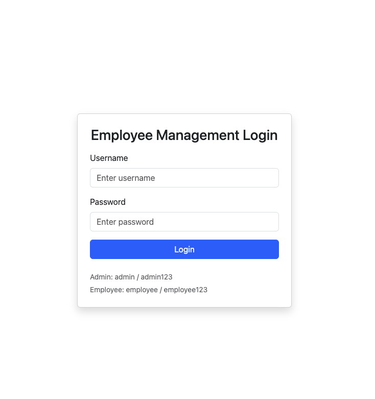

### Admin Dashboard View

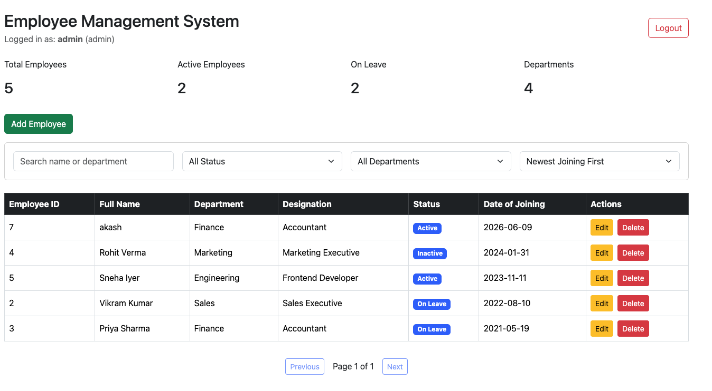

### Employee Dashboard View

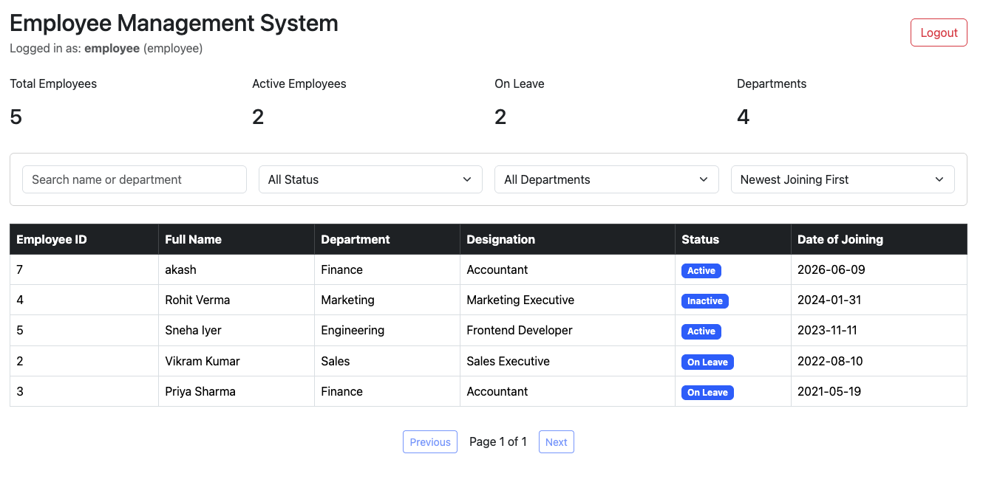

### Dashboard and Employee Table

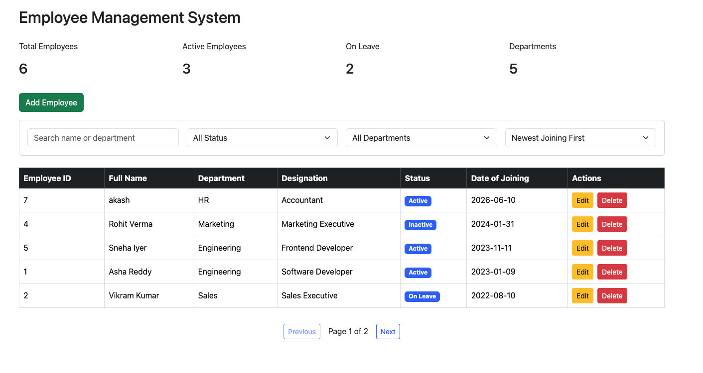

### Employee Form

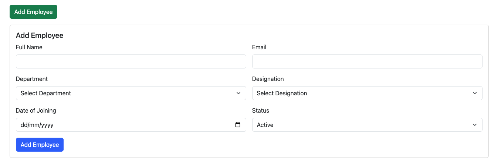

### Employee Leave Request View

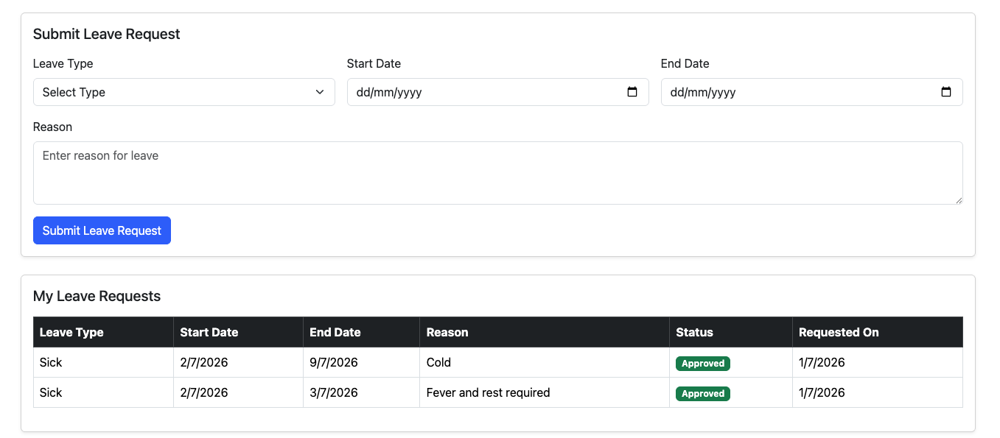

### Admin Leave Approval View

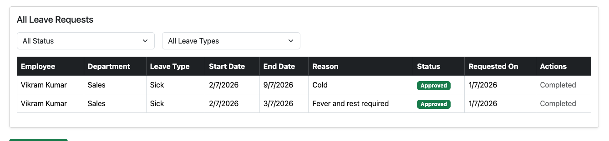

### Reporting Dashboard Charts

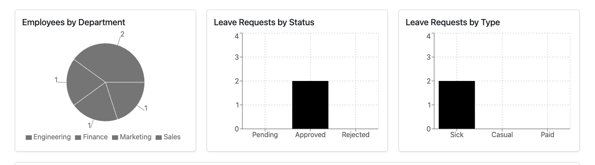

### Performance Review Table

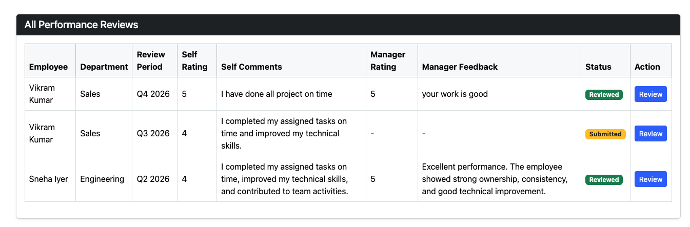

### Payroll Table

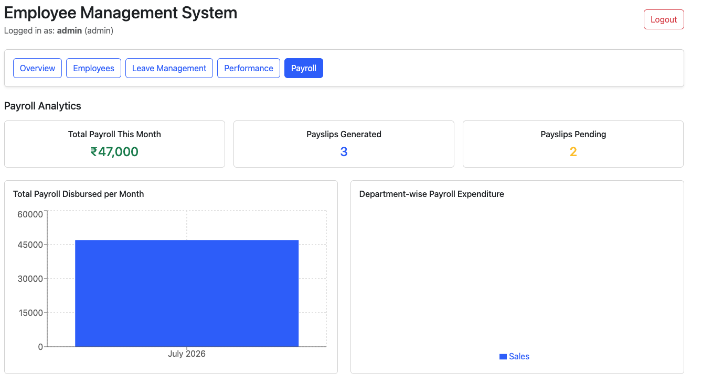
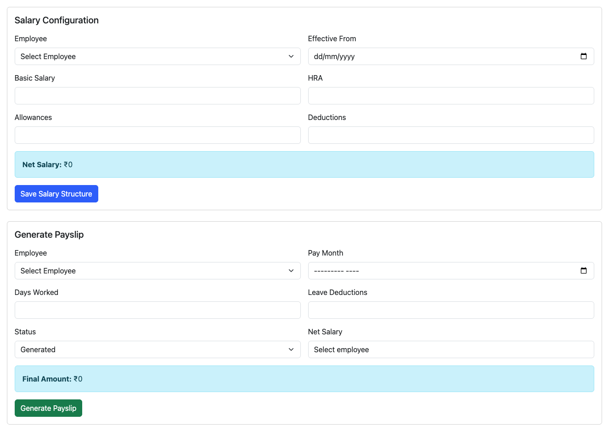
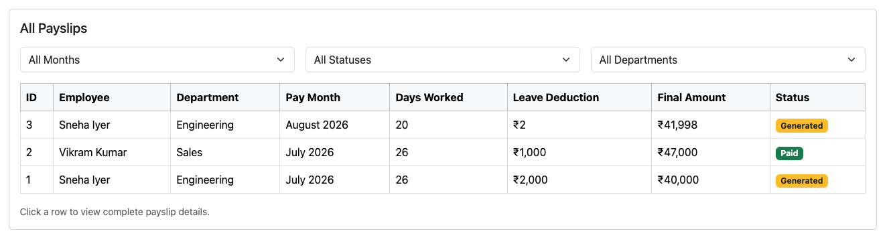

### Mobile Responsive View


---

## Folder Structure

```txt
employee-management-system/
│
├── client/
│   ├── public/
│   │
│   └── src/
│       ├── components/
│       │   ├── DashboardCards.jsx
│       │   ├── EmployeeDetails.jsx
│       │   ├── EmployeeForm.jsx
│       │   ├── EmployeeTable.jsx
│       │   ├── LeaveForm.jsx
│       │   ├── LeaveTable.jsx
│       │   ├── PayrollCharts.jsx
│       │   ├── PayslipGenerator.jsx
│       │   ├── PayslipTable.jsx
│       │   ├── PerformanceCharts.jsx
│       │   ├── PerformanceForm.jsx
│       │   ├── PerformanceTable.jsx
│       │   ├── ReportCharts.jsx
│       │   └── SalaryForm.jsx
│       │
│       ├── context/
│       │   └── AuthContext.jsx
│       │
│       ├── pages/
│       │   ├── Dashboard.jsx
│       │   └── Login.jsx
│       │
│       ├── services/
│       │   └── api.js
│       │
│       ├── App.jsx
│       ├── main.jsx
│       └── index.css
│
├── server/
│   ├── config/
│   │   └── db.js
│   │
│   ├── controllers/
│   │   ├── authController.js
│   │   ├── employeeController.js
│   │   ├── leaveController.js
│   │   ├── payrollController.js
│   │   ├── performanceController.js
│   │   └── reportController.js
│   │
│   ├── middleware/
│   │   └── authMiddleware.js
│   │
│   ├── routes/
│   │   ├── authRoutes.js
│   │   ├── employeeRoutes.js
│   │   ├── leaveRoutes.js
│   │   ├── payrollRoutes.js
│   │   ├── performanceRoutes.js
│   │   └── reportRoutes.js
│   │
│   ├── services/
│   │   └── reportServices.js
│   ├── database.sql
│   ├── server.js
│   └── .env
│
├── screenshots/
│   ├── login_form.png
│   ├── login_admin_view.png
│   ├── login_employee_view.png
│   ├── Dashboard&table.png
│   ├── form.png
│   ├── employee_leave_request_form.png
│   ├── employee_leave_status_table.png
│   ├── admin_leave_approval_view.png
│   ├── reporting_dashboard_charts.png
│   ├── performance_self_appraisal_form.png
│   ├── performance_review_history.png
│   ├── admin_performance_review_interface.png
│   ├── performance_dashboard_charts.png
│   ├── mobile_responsive_1.png
│   └── mobile_responsive_2.png
│   └── performance-reviews.png
│
├── README.md
├── package.json
└── .gitignore
```

### Leave Management Module

- Employees can submit leave requests with leave type, start date, end date, and reason.
- Mandatory field validation is added for the leave request form.
- End date must be greater than or equal to start date.
- Employees can view only their own leave request status.
- Admin can view all leave requests.
- Admin can filter leave requests by status and leave type.
- Admin can approve or reject pending leave requests with confirmation.

### Visual Reporting Dashboard

- Employees by Department chart.
- Leave Requests by Status chart.
- Leave Requests by Type chart.
- Charts are built using Recharts.
- Dashboard charts update using live API data.
- Loading and empty states are handled for reports and leave data.

## Performance Management & Appraisal Module

As part of Task 6, a Performance Management & Appraisal Module was added to the existing Employee Management System.

### Features Added

- Employees can submit self-appraisals with review period, self rating, and self comments.
- Employees can view their own performance review history.
- Admin can view all submitted performance reviews.
- Admin can provide manager rating and manager feedback.
- Review status updates from `Submitted` to `Reviewed` after admin review.
- Performance dashboard includes visual reports using Recharts.
- Added KPI cards for reviewed performance data.
- Added bar chart for average rating by department.
- Added pie chart for rating distribution.
- Added trend chart for performance review periods.
- APIs are protected using JWT authentication.
- Role-based access control is applied:
  - Employee can submit and view own reviews.
  - Admin can review, rate, and view performance summaries.
- Frontend is organized using reusable components:
  - `PerformanceForm.jsx`
  - `PerformanceTable.jsx`
  - `PerformanceCharts.jsx`
- Dashboard layout was improved using section buttons to avoid showing all modules at once.

### Performance Workflow

```text
Employee Login
     ↓
Submit Self-Appraisal
     ↓
Status: Submitted
     ↓
Admin Login
     ↓
Manager Review & Rating
     ↓
Status: Reviewed
     ↓
Dashboard Charts Updated
```
