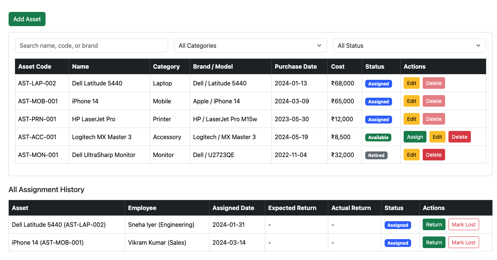

# Employee Management System

A full-stack Employee Management System built using **React.js, Node.js, Express.js, MySQL, JWT Authentication, and Role-Based Access Control (RBAC)**.

This project allows users to securely log in and manage employee records, leave requests, performance appraisals, payroll, and company assets, with access scoped by role.

---

## Project Overview

The Employee Management System is a responsive web application used to manage employee records end-to-end — from onboarding and leave, to performance reviews, payroll, and company asset tracking.

The project includes:

- React.js frontend
- Node.js and Express.js backend
- MySQL database
- JWT-based authentication
- Role-Based Access Control
- Protected API routes
- Responsive dashboard UI

---

## Tech Stack

### Frontend

- React.js
- JavaScript
- Bootstrap
- Axios
- Recharts
- HTML5
- CSS3
- Vite

### Backend

- Node.js
- Express.js
- JWT Authentication
- MySQL2

### Tools

- Postman
- Git & GitHub

---

## Features Implemented

### Authentication

- Login system using username and password
- JWT token generation after successful login
- Invalid login handling
- Logout functionality
- Protected frontend dashboard

### Role-Based Access Control

Three roles are implemented: **Admin**, **Manager**, and **Employee**.

#### Admin

Admin can:

- View all employees
- Add new employees
- Edit employee details
- Delete employees
- Search, filter, sort, and paginate records
- Approve or reject employee leave requests
- Create, update, and view all performance appraisals and KPIs
- Set and update employee salary structures
- Generate and manage employee payslips
- Maintain the company asset register, assign/retrieve assets, and view asset analytics

#### Manager

Manager can:

- Login to the system
- View employee records
- Create and update performance reviews and KPIs, but only for employees
  who report to them (`employees.manager_id`)
- View the performance dashboard (cards + charts)
- Submit leave requests and track their own status, same as an employee
- View assets assigned to employees within their team

#### Employee

Employee can:

- Login to the system
- View employee records
- Search, filter, sort, and paginate records
- Submit leave requests and track their status
- View their own completed performance reviews and KPI feedback
- View their own salary structure and payslips
- View assets currently and previously assigned to them, including expected return dates

Employee users cannot add, edit, or delete employee records.

---

## Dashboard Summary

The dashboard displays summary cards for:

- Total Employees
- Active Employees
- Employees on Leave
- Departments Count

The cards update automatically based on backend data.

---

## Employee Management

Admin can manage employee records with the following features:

- View all employees in a responsive table
- Add new employee
- Edit existing employee
- Delete employee
- View complete employee details in a modal

---

## Search, Filter, Sort and Pagination

The employee table includes:

- Search by employee name or department
- Filter by status
- Filter by department
- Sort by date of joining
- Pagination with 5 records per page

---

## Form Validation

The employee form includes:

- Required field validation
- Email format validation
- Date of joining cannot be a future date
- Inline validation messages

---

## API Integration

- Axios is used for frontend API calls
- Backend REST APIs are built with Express.js
- JWT token is sent in request headers for protected routes
- Error messages are displayed for failed API requests

---

## Screenshots

### Login Page


### Admin Dashboard View


### Employee Dashboard View


### Dashboard and Employee Table


### Employee Form


### Employee Leave Request View


### Admin Leave Approval View


### Reporting Dashboard Charts


### Performance Review Table


### Payroll - Salary Structure & Payslip Generation


### Payroll - Payslip History


### Payroll - Analytics Dashboard


### KPI Scores


### Assets page



### Mobile Responsive View


---

## Folder Structure

```txt
employee-management-system/
│
├── client/
│   ├── public/
│   │
│   └── src/
│       ├── components/
│       │   ├── AssetAssignment.jsx
│       │   ├── AssetCharts.jsx
│       │   ├── AssetDashboard.jsx
│       │   ├── AssetForm.jsx
│       │   ├── AssetTable.jsx
│       │   ├── AttendanceReports.jsx
│       │   ├── DashboardCards.jsx
│       │   ├── DashboardReports.jsx
│       │   ├── EmployeeDetails.jsx
│       │   ├── EmployeeForm.jsx
│       │   ├── EmployeeReports.jsx
│       │   ├── EmployeeTable.jsx
│       │   ├── ExportButtons.jsx
│       │   ├── LeaveForm.jsx
│       │   ├── LeaveReports.jsx
│       │   ├── LeaveTable.jsx
│       │   ├── PayrollCharts.jsx
│       │   ├── PayrollReports.jsx
│       │   ├── PayslipGenerator.jsx
│       │   ├── PayslipTable.jsx
│       │   ├── PerformanceReviewForm.jsx
│       │   ├── PerformanceReviewTable.jsx
│       │   ├── PerformanceDashboard.jsx
│       │   ├── KPIForm.jsx
│       │   ├── RatingChart.jsx
│       │   ├── ReportCharts.jsx
│       │   └── SalaryForm.jsx
│       │
│       ├── context/
│       │   └── AuthContext.jsx
│       │
│       ├── pages/
│       │   ├── Dashboard.jsx
│       │   └── Login.jsx
│       │
│       ├── services/
│       │   └── api.js
│       │
│       ├── App.jsx
│       ├── main.jsx
│       └── index.css
│
├── server/
│   ├── config/
│   │   └── db.js
│   │
│   ├── controllers/
│   │   ├── assetController.js
│   │   ├── authController.js
│   │   ├── employeeController.js
│   │   ├── leaveController.js
│   │   ├── payrollController.js
│   │   ├── performanceController.js
│   │   └── reportController.js
│   │
│   ├── middleware/
│   │   └── authMiddleware.js
│   │
│   ├── routes/
│   │   ├── assetRoutes.js
│   │   ├── authRoutes.js
│   │   ├── employeeRoutes.js
│   │   ├── leaveRoutes.js
│   │   ├── payrollRoutes.js
│   │   ├── performanceRoutes.js
│   │   └── reportRoutes.js
│   │
│   ├── services/
│   │   ├── assetService.js
│   │   ├── reportServices.js
│   │   └── performanceService.js
│   │
│   ├── database.sql
│   ├── server.js
│   └── .env
│
├── screenshots/
│   ├── login_form.png
│   ├── login_admin_view.png
│   ├── login_employee_view.png
│   ├── Dashboard&table.png
│   ├── form.png
│   ├── employeeview_leave_request.png
│   ├── adminview_leave_request.png
│   ├── charts.png
│   ├── performance-reviews.png
│   ├── payroll-1.png
│   ├── payroll-2.png
│   ├── payroll-3.png
│   ├── mobile responsive 1.png
│   └── mobile responsive 2.png
│
├── README.md
├── package.json
└── .gitignore
```

### Leave Management Module

- Employees can submit leave requests with leave type, start date, end date, and reason.
- Mandatory field validation is added for the leave request form.
- End date must be greater than or equal to start date.
- Employees can view only their own leave request status.
- Admin can view all leave requests.
- Admin can filter leave requests by status and leave type.
- Admin can approve or reject pending leave requests with confirmation.

### Visual Reporting Dashboard

- Employees by Department chart.
- Leave Requests by Status chart.
- Leave Requests by Type chart.
- Charts are built using Recharts.
- Dashboard charts update using live API data.
- Loading and empty states are handled for reports and leave data.

---

## Employee Performance Management & Appraisal Module

A manager-driven, KPI-based appraisal workflow, supporting the admin/manager/employee roles described above.

### Roles

| Role         | What they can do in this module                                                                                                                       |
| ------------ | ----------------------------------------------------------------------------------------------------------------------------------------------------- |
| **Admin**    | Full access — create/update reviews and KPIs for any employee, view the dashboard, view all records.                                                  |
| **Manager**  | Create and update reviews and KPIs, but only for employees whose `manager_id` points back to them (their own team). Sees the same dashboard as admin. |
| **Employee** | Read-only. Can only view their own reviews, and only once a review's status is `Submitted` or `Completed`.                                            |

Reporting-manager relationships live on `employees.manager_id` (self
referencing FK). Admin assigns this from the **Reporting Manager** field on
the Add/Edit Employee form.

There's no in-app screen for creating login accounts (this project has
always added rows to `users` directly), so to test the manager role, either
use the seeded `manager` / `manager123` account or add another one the same
way — see the SQL comments in `server/database.sql`.

### Database Schema

- **`performance_reviews`**: `id`, `employee_id` (FK), `manager_id`
  (FK, nullable), `review_period`, `overall_rating` (1–5), `overall_feedback`,
  `review_status` (`Draft` / `Submitted` / `Completed`), `submitted_on`,
  `created_at`. Unique on `(employee_id, review_period)` to block duplicate
  reviews for the same period.
- **`performance_kpis`**: `id`, `review_id` (FK, cascades on delete),
  `kpi_name`, `kpi_score` (1–5), `remarks`, `created_at`.
- **`employees.manager_id`**: self-referencing FK used to scope a
  manager to their team.
- **`users.role`**: `ENUM('admin', 'manager', 'employee')`.

### API Documentation

All routes are under `/performance` and require a Bearer token.

| Method | Route                     | Who            | Description                                                                                                                    |
| ------ | ------------------------- | -------------- | ------------------------------------------------------------------------------------------------------------------------------ |
| POST   | `/performance/review`     | Manager, Admin | Create a review in `Draft` status for an employee + review period.                                                             |
| PUT    | `/performance/review/:id` | Manager, Admin | Update overall rating/feedback, or submit the review (`review_status: "Submitted"`). Only allowed while the review is `Draft`. |
| GET    | `/performance/reviews`    | All            | Admin sees all reviews; manager sees reviews they created; employee sees their own `Submitted`/`Completed` reviews.            |
| GET    | `/performance/review/:id` | All            | Single review with its KPIs, same visibility rules as above.                                                                   |
| POST   | `/performance/kpi`        | Manager, Admin | Add a KPI to a `Draft` review.                                                                                                 |
| PUT    | `/performance/kpi/:id`    | Manager, Admin | Edit a KPI on a `Draft` review.                                                                                                |
| DELETE | `/performance/kpi/:id`    | Manager, Admin | Remove a KPI from a `Draft` review.                                                                                            |
| GET    | `/performance/dashboard`  | Manager, Admin | Summary cards + chart data (see below).                                                                                        |

### Validation & Business Rules

- KPI scores and the overall rating must be between 1 and 5.
- A review needs at least **3 KPIs** before it can be submitted.
- Once a review is `Submitted`, its fields and KPIs can no longer be edited
  or deleted.
- Duplicate reviews for the same employee + review period are rejected
  (both at the API level and with a DB unique constraint).
- A manager can only create/update reviews and KPIs for employees in their
  own team (`employees.manager_id`).

### Dashboard

- Cards: Total Reviews, Pending Reviews, Completed Reviews, Average Rating.
- Charts (Recharts, via a shared `RatingChart.jsx` component): Department-wise
  Average Rating (bar), Rating Distribution (pie), Monthly Completed Reviews
  (line), Top Performing Departments (bar).

### Frontend Components

- `PerformanceReviewForm.jsx` — manager/admin picks an employee + review
  period to start a Draft review.
- `PerformanceReviewTable.jsx` — role-aware list of reviews; clicking a row
  opens KPI management (for reviewers) or a read-only view (for employees).
- `KPIForm.jsx` — adds a single KPI to a Draft review.
- `PerformanceDashboard.jsx` — the summary cards and charts described above.
- `RatingChart.jsx` — a small reusable chart card (bar/pie/line) shared by
  all four dashboard charts.

### Performance Workflow

```text
Manager/Admin Login
     ↓
Create Review (Draft) for an employee + review period
     ↓
Add at least 3 KPIs, set overall rating & feedback
     ↓
Submit Review → Status: Submitted (locked, no further edits)
     ↓
Employee Login → views the completed review and its KPIs
     ↓
Dashboard Cards & Charts Updated
```

---

## Payroll Management Module

A Payroll Management Module allows admins to define salary structures and generate payslips, while employees can view their own salary and payslip history.

### Features

- Admin can set a salary structure for any employee with basic salary, HRA, allowances, deductions, and an effective-from date.
- Net salary is auto-calculated as `Basic Salary + HRA + Allowances - Deductions` and previewed live in the form.
- All salary fields are validated as required, numeric, and non-negative before submission.
- Admin can view the latest salary structure of any employee; employees can view only their own.
- Admin can generate a payslip for an employee by selecting the pay month, days worked, and leave deductions.
- The final amount paid is auto-calculated from the employee's net salary minus leave deductions.
- Duplicate payslips for the same employee and pay month are blocked.
- Payslip status can be tracked as `Generated` or `Paid`.
- Admin can view payslip history for all employees; employees can view only their own payslip history.
- Each payslip has a detailed view showing salary breakup, pay month, days worked, deductions, and final amount paid.
- A Payroll Analytics dashboard displays:
  - KPI cards for total payroll paid this month, payslips generated, and payslips pending.
  - Monthly payroll trend chart.
  - Department-wise payroll distribution chart.
- Payroll charts are built using Recharts and update from live API data.
- APIs are protected using JWT authentication.
- Role-based access control is applied:
  - Employee can view only their own salary structure and payslips.
  - Admin can set salary structures, generate payslips, and view payroll analytics.
- Frontend is organized using reusable components:
  - `SalaryForm.jsx`
  - `PayslipGenerator.jsx`
  - `PayslipTable.jsx`
  - `PayrollCharts.jsx`

### Payroll Workflow

```text
Admin Login
     ↓
Set Employee Salary Structure
     ↓
Generate Monthly Payslip
     ↓
Status: Generated
     ↓
Payment Processed
     ↓
Status: Paid
     ↓
Payroll Analytics Dashboard Updated
```

---

## Employee Asset Management Module

An Employee Asset Management Module lets admins maintain a company asset
register, assign and retrieve assets from employees, monitor asset
availability, and view a complete assignment history.

### Database Schema

**`assets`**

| Column               | Type                                                       | Notes                                  |
| -------------------- | ---------------------------------------------------------- | -------------------------------------- |
| id                   | INT, PK, auto-increment                                    |                                        |
| asset_name           | VARCHAR(150)                                               | required                               |
| asset_category       | VARCHAR(100)                                               | required, e.g. Laptop, Mobile, Monitor |
| asset_code           | VARCHAR(50)                                                | required, unique                       |
| brand                | VARCHAR(100)                                               | optional                               |
| model                | VARCHAR(100)                                               | optional                               |
| purchase_date        | DATE                                                       | required                               |
| purchase_cost        | DECIMAL(10,2)                                              | default 0, must be ≥ 0                 |
| warranty_expiry_date | DATE                                                       | optional                               |
| asset_status         | ENUM('Available','Assigned','Under Maintenance','Retired') | default `Available`                    |
| created_at           | TIMESTAMP                                                  | default current timestamp              |

**`asset_assignments`**

| Column               | Type                               | Notes                             |
| -------------------- | ---------------------------------- | --------------------------------- |
| id                   | INT, PK, auto-increment            |                                   |
| asset_id             | INT, FK → assets(id)               | cascade delete                    |
| employee_id          | INT, FK → employees(id)            | cascade delete                    |
| assigned_date        | DATE                               | required                          |
| expected_return_date | DATE                               | optional, must be ≥ assigned_date |
| actual_return_date   | DATE                               | set when returned/lost            |
| assignment_status    | ENUM('Assigned','Returned','Lost') | default `Assigned`                |
| remarks              | TEXT                               | optional                          |
| created_at           | TIMESTAMP                          | default current timestamp         |

A same-asset "only one active assignment at a time" rule is enforced at the
application layer (`assignAsset` in `assetController.js` checks the asset's
current status before creating a new assignment) rather than as a DB
constraint, for reliability across MySQL versions.

### API Documentation

All endpoints below require `Authorization: Bearer <token>`.

| Method | Endpoint              | Access                                        | Description                                                                                |
| ------ | --------------------- | --------------------------------------------- | ------------------------------------------------------------------------------------------ |
| POST   | `/assets`             | Admin                                         | Create a new asset                                                                         |
| PUT    | `/assets/:id`         | Admin                                         | Update asset details / status                                                              |
| DELETE | `/assets/:id`         | Admin                                         | Delete asset (blocked if currently Assigned)                                               |
| GET    | `/assets`             | Admin (all), Manager (team's assigned assets) | List/search/filter assets (`search`, `category`, `status` query params)                    |
| GET    | `/assets/:id`         | Admin                                         | Get a single asset                                                                         |
| POST   | `/assets/assign`      | Admin                                         | Assign an Available asset to an employee                                                   |
| POST   | `/assets/return`      | Admin                                         | Record a return (or mark Lost)                                                             |
| GET    | `/assets/assignments` | All roles (scoped)                            | Assignment history — admin sees all, manager sees their team, employee sees only their own |
| GET    | `/assets/dashboard`   | Admin                                         | Dashboard cards + chart data                                                               |

Employees call `/assets/assignments` (not `/assets`) to see the assets
currently and previously assigned to them.

### Business Rules Enforced

- `asset_code` is unique (DB constraint + friendly 400 error on duplicate).
- An asset can only be assigned while its status is `Available`.
- Duplicate active assignments for the same asset are prevented at the
  application layer (the asset must be `Available` before it can be
  assigned).
- Returning an asset automatically flips it back to `Available`; marking it
  `Lost` retires it instead.
- `expected_return_date` cannot be earlier than `assigned_date` (validated on
  both client and server).
- Assets currently `Assigned` cannot be deleted.

### Frontend Components

- `AssetForm.jsx` — add/edit an asset
- `AssetTable.jsx` — searchable/filterable asset list with admin actions
- `AssetAssignment.jsx` — assignment history table + `AssignAssetForm`
- `AssetDashboard.jsx` — summary cards
- `AssetCharts.jsx` — category/status/monthly/department charts (reuses the
  existing `RatingChart` component)

### Asset Workflow

```text
Admin Login
     ↓
Add Asset (status: Available)
     ↓
Assign Asset to Employee
     ↓
Status: Assigned
     ↓
Employee Returns Asset
     ↓
Status: Available (or Retired if Lost)
     ↓
Asset Dashboard Updated
```

---

## Setup Instructions

1. **Clone the repository**

   ```bash
   git clone <repository-url>
   cd employee-management-system
   ```

2. **Set up the database**

   ```bash
   cd server
   mysql -u root -p employee_management < database.sql
   ```

   `database.sql` creates every table used by this project (employees, users,
   leave requests, performance reviews & KPIs, payroll, and assets) and
   inserts demo data. It's safe to re-run the whole file.

3. **Configure environment variables**

   Create a `.env` file inside `server/` with your database credentials and
   JWT secret (see `.env` for the expected variable names).

4. **Install dependencies and start the backend**

   ```bash
   cd server
   npm install
   npm run dev
   ```

5. **Install dependencies and start the frontend**

   ```bash
   cd client
   npm install
   npm run dev
   ```

6. **Log in**

   Use the seeded accounts (see `server/database.sql`) — for example
   `admin` / `admin123`, `manager` / `manager123`, or an employee account —
   to explore the Employee, Leave, Performance, Payroll, and Asset modules
   scoped to that role.
